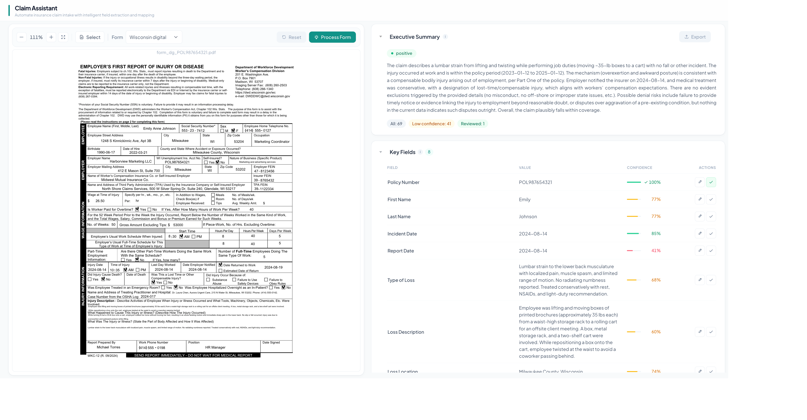

<div align="center">


# Claim Assistant

[](https://www.python.org/downloads/)
[](https://www.typescriptlang.org/)
[](https://fastapi.tiangolo.com/)
[](https://nextjs.org/)
[](https://react.dev/)
[](https://openai.com/)
[](https://azure.microsoft.com/en-us/products/ai-services/ai-document-intelligence)
[](https://www.docker.com/)

AI-powered automation tool that streamlines insurance claim handling with LLM-based PDF processing, policy matching, and coverage analysis.

**[Live Demo](https://claim-assistant.symfa.ai/)** · **[GitHub](https://github.com/Symfa-Inc/claim-assistant)** · **[Confluence](https://symfa.atlassian.net/wiki/spaces/SYMFA/pages/5012094982)**

</div>

## Preview

<p align="center">

</p>

## Features

- **Automated PDF Processing** – Extract key fields from filled claim forms using Azure Document Intelligence and LLM pipelines
- **Policy Matching** – Map extracted claim data against policy records for validation
- **Confidence Scoring** – Per-field certainty scores with low-confidence queue for reviewer prioritization
- **Coverage Analysis** – Structured summaries with coverage status (covered / not covered / uncertain)
- **Report Generation** – Adjuster-facing PDF reports with analysis results
- **Review Workflow** – Inline field editing, approval/revoke flow, and review-gated ASC export

## How It Works

The service converts filled insurance claim forms (PDFs) into structured data through a five-stage pipeline:

1. **Data Preparation** – Handle scanned/image-based PDFs and extract text
2. **Key Extraction** – Extract form fields using LLM-based structured extraction
3. **Policy Mapping** – Retrieve relevant policy data based on extracted identifiers
4. **Analysis Generation** – Evaluate coverage with deterministic checks and LLM reasoning
5. **Report Generation** – Produce adjuster-facing PDF reports

## Tech Stack

| Category | Technologies |
|----------|-------------|
| Backend | Python 3.13, FastAPI, Uvicorn |
| Frontend | TypeScript, Next.js, React, Tailwind CSS |
| AI/ML | OpenAI, Azure Document Intelligence |
| PDF | PyPDF2, FillPDF, ReportLab |
| Data | Pydantic, pandas |
| Package Management | uv (backend), pnpm (frontend) |
| Deployment | Docker, GitHub Actions, Google Artifact Registry |

## Getting Started

### Prerequisites

- Python 3.13+ / [uv](https://docs.astral.sh/uv/)
- Node.js 24+ / [pnpm](https://pnpm.io/)

### Installation & Running

```bash
# Backend
cd backend
cp .env.example src/claim_assistant/.env    # Add your API keys
uv sync
uv run uvicorn claim_assistant.web.main:app --reload

# Frontend (in a separate terminal)
cd frontend
pnpm install
pnpm dev
```

Open [http://localhost:3000](http://localhost:3000) (frontend) and [http://localhost:8000/docs](http://localhost:8000/docs) (API docs).

## License

[MIT](LICENSE)
