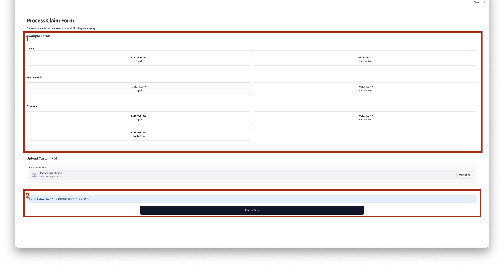
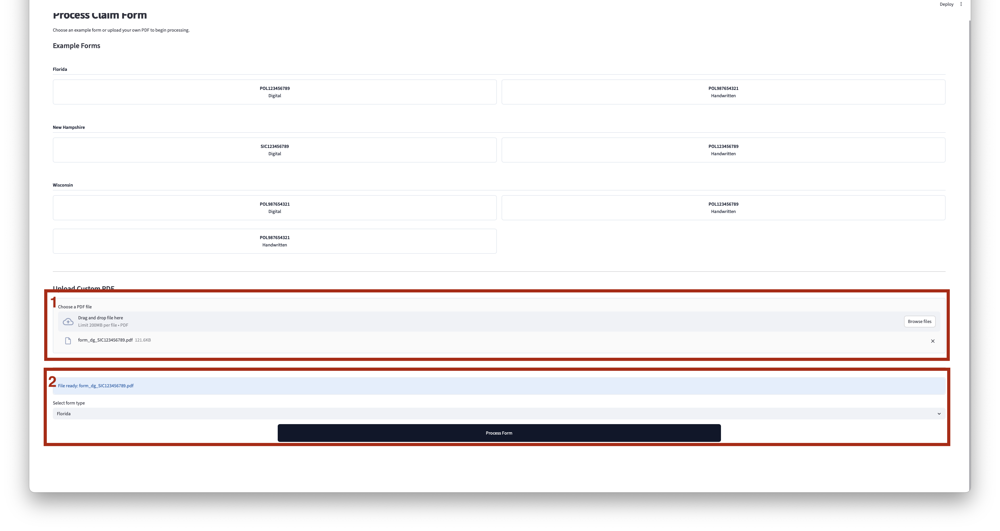
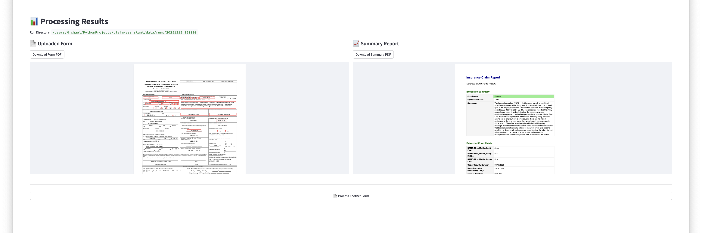

<div align="center">


# Claim Assistant

[](https://www.python.org/downloads/)
[](https://openai.com/)
[](https://www.docker.com/)
[](https://streamlit.io/)

**AI-powered automation tool that streamlines insurance claim handling by replacing repetitive adjuster tasks with intelligent LLM-based assistants.**

🔗 **Live Demo**: [claim-assistant-demo.d11.symfa.com](https://claim-assistant-demo.d11.symfa.com/)

</div>


## Overview

Claim Assistant automates claim processing for insurance companies through a modular pipeline architecture. The service converts filled insurance claim forms (PDFs) into structured data, matches claims against policy records, and produces analytical outputs that support insurance adjusters in evaluating claims.

### Key Features

- **Automated PDF Processing** – Extract key fields from filled claim forms using LLM-based pipelines
- **Policy Matching** – Map extracted claim data against policy records for validation
- **Confidence Scoring** – Account for OCR/LLM uncertainty with built-in confidence classification
- **Coverage Analysis** – Generate structured summaries with coverage status (covered / not covered / manual review)
- **Report Generation** – Produce adjuster-facing PDF reports with analysis results

### Target Audience

Claims managers, operations teams, and analysts who need to process insurance claims efficiently without technical expertise.

## Tech Stack

| Category | Technologies |
|----------|-------------|
| **Language** | Python 3.13 |
| **UI Framework** | Streamlit |
| **AI/ML** | OpenAI API (GPT-4) |
| **PDF Processing** | PyPDF, FillPDF, ReportLab |
| **Data Validation** | Pydantic |
| **Package Management** | uv |
| **Deployment** | Docker |

## Pipeline Architecture

The claim processing pipeline consists of five modular stages:

```
┌─────────────────┐     ┌─────────────────┐     ┌─────────────────┐
│  1. Data Prep   │ ──▶ │  2. Key         │ ──▶ │  3. Policy      │
│  (PDF → Text)   │     │  Extraction     │     │  Mapping        │
└─────────────────┘     └─────────────────┘     └─────────────────┘
                                                        │
                                                        │
                                                        ▼
                        ┌─────────────────┐     ┌─────────────────┐
                        │  5. Report      │ ◀── │  4. Analysis    │
                        │  Generation     │     │  Generation     │
                        └─────────────────┘     └─────────────────┘
```

| Stage | Purpose |
|-------|---------|
| **Data Preparation** | Handle scanned/image-based PDFs and prepare textual input |
| **Key Extraction** | Extract form fields using LLM-based structured extraction |
| **Policy Mapping** | Retrieve relevant policy data based on extracted identifiers |
| **Analysis Generation** | Evaluate coverage status with deterministic checks + LLM reasoning |
| **Report Generation** | Create adjuster-facing PDF reports with analysis results |

## Project Structure

```
claim-assistant/
├── src/claim_assistant/    # Main application source code
├── data/                   # Sample forms, policies, and processing runs
├── notebooks/              # Jupyter notebooks for experimentation
├── metrics/                # Evaluation metrics and benchmarks
├── Dockerfile              # Container configuration
└── pyproject.toml          # Project dependencies and metadata
```

## Getting Started

### Prerequisites

- Python 3.13+
- [uv](https://github.com/astral-sh/uv) package manager
- OpenAI API key

### Installation

```bash
# Clone the repository
git clone https://github.com/Symfa-Inc/claim-assistant.git
cd claim-assistant

# Install dependencies
uv sync
```

### Configuration

Provide your OpenAI API key using one of the following methods:

**Option 1: Environment Variable**
```bash
export OPENAI_API_KEY="your_api_key_here"
```

**Option 2: .env File** (recommended for local development)

Create `src/claim_assistant/.env` with:
```
OPENAI_API_KEY=your_api_key_here
```

### Running Locally

```bash
streamlit run src/claim_assistant/app.py
```

The application will be available at `http://localhost:8501`.

## Processing Demo Files

The repository includes sample claim forms for testing in the `data/` directory:

1. Launch the application
2. Select a prepared sample from the dropdown (grouped by state)
3. Click **Process Form** to start claim processing
4. Review the generated coverage analysis report

All processing artifacts are saved to `data/runs/` with timestamped folders containing:
- Input PDF
- Generated claim summary PDF
- Intermediate logs for debugging

## Demo

### 1. Select a Prepared Sample

The application displays available example claim forms grouped by state. Each example represents a pre-filled claim tied to a mock policy. Forms can be either **Digital** (typed fonts) or **Handwritten**.



### 2. Upload a Custom Claim Form

Alternatively, upload your own filled PDF claim form and select the corresponding form type.



### 3. Review Processing Results

Once processing is complete, view the original claim form alongside the generated claim summary report.



## License

This project is licensed under the Apache License 2.0 – see the [LICENSE](LICENSE) file for details.
