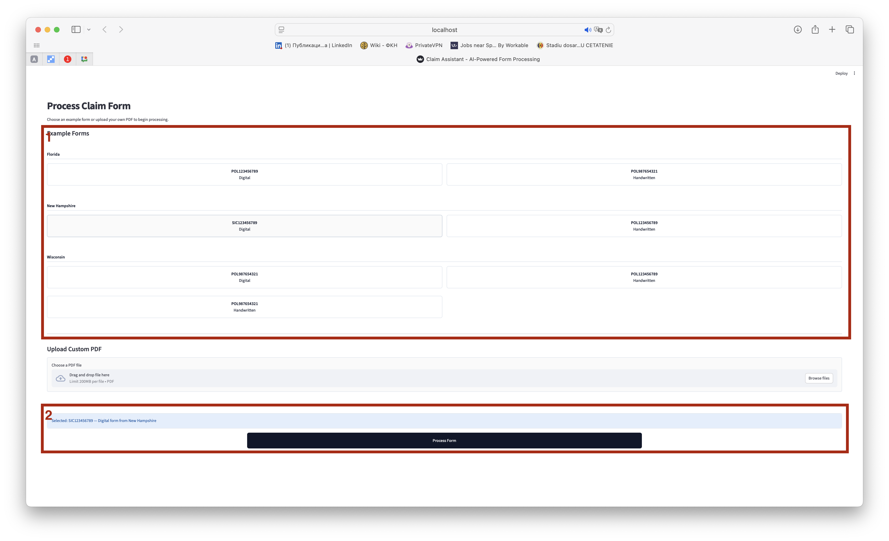
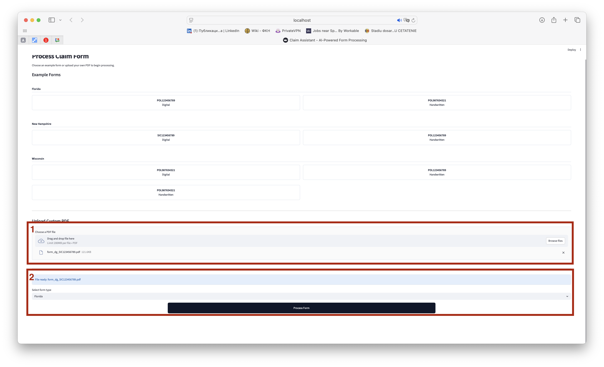
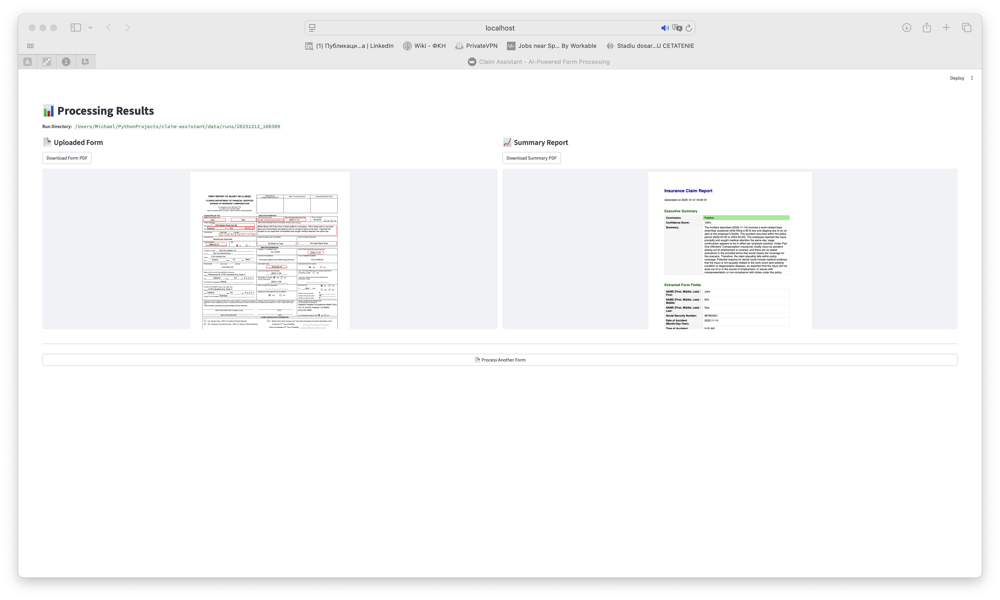

# Claim Assistant

**Claim Assistant** is a Streamlit-based internal tool for **AI-assisted insurance claim processing**.
It allows non-technical users (claims managers, operations, analysts) to process filled claim forms (PDFs) and receive an automated coverage analysis based on policy data.

The project is currently focused **exclusively on claim processing**.
Form model creation/editing is intentionally out of scope at this stage.

---

## What the application does

At a high level, Claim Assistant:

1. Accepts a filled insurance claim form (PDF)
2. Extracts key fields using an LLM-based pipeline
3. Matches the claim against policy records
4. Computes confidence scores to account for OCR/LLM uncertainty
5. Produces a structured **coverage analysis summary** (PDF + on-screen view)

---

## How the application works (user flow)

### 1. Select a prepared sample

The application scans available example claim forms from the repository and displays them in a table.
Each example represents a realistic pre-filled claim tied to a mock policy.

1. You may select one of the prepared examples grouped by state.
   - **Digital** means the form was filled using typed fonts.
   - **Handwritten** means the form was filled using a handwritten script.

2. Click **Process Form** to start claim processing.



---

### 2. Upload a new claim form

Alternatively, users can upload their own filled PDF claim form.
After selecting “Upload custom PDF”, the interface allows:
1. Uploading a PDF
2. Selecting the corresponding form type (state)



---

### 3. Review processing results

Once processing is complete, the Results view displays:
- The original uploaded claim form
- A generated claim summary report (PDF)
- Clear navigation to process another form



---

## Confidence and uncertainty handling

Because the system relies on OCR and LLM-based extraction, **confidence scoring is built in**:

- Name, policy number, and dates are compared against policy records
- Outcomes are classified as:
  - **Positive** — likely covered
  - **Negative** — likely not covered
  - **Uncertain** — there were errors in OCR

---

### Output artifacts

All artifacts generated during processing are saved to the `data/runs/` directory.

Each run is stored in a separate timestamped folder and typically includes:
- The input PDF used for processing
- The generated claim summary PDF
- Intermediate logs and outputs used for analysis and debugging

---

## Running the application locally

### Requirements

- Python 3.13
- An OpenAI API key

### Install dependencies

```bash
uv sync
```

### Configure OpenAI API key

You can provide the API key in either of the following ways:

#### Option 1: Environment variable
```bash
export OPENAI_API_KEY="your_api_key_here"
```

#### Option 2: .env file (recommended for local use)
Create the file:

```
src/claim_assistant/.env
```

With contents:

```
OPENAI_API_KEY=your_api_key_here
```
The application automatically loads this file at startup.
---

### Launch the application

From the project root:

```bash
streamlit run src/claim_assistant/app.py
```

Streamlit will print a local URL (usually http://localhost:8501) where the UI is available.

---

## Project status

- ✅ Claim processing pipeline implemented
- ✅ Confidence-aware decision logic
- ✅ Streamlit UI for non-technical users
